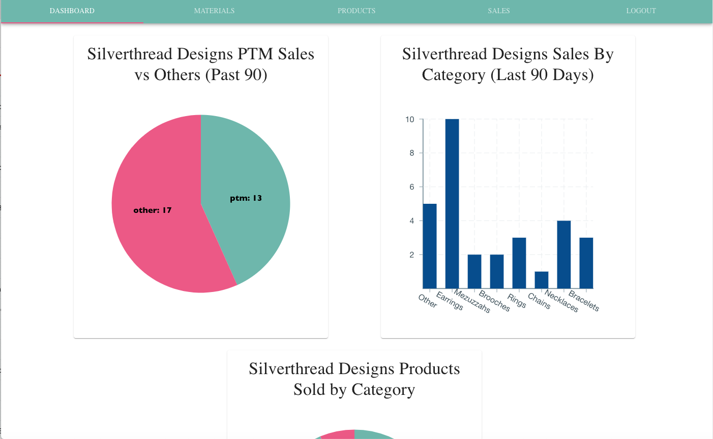
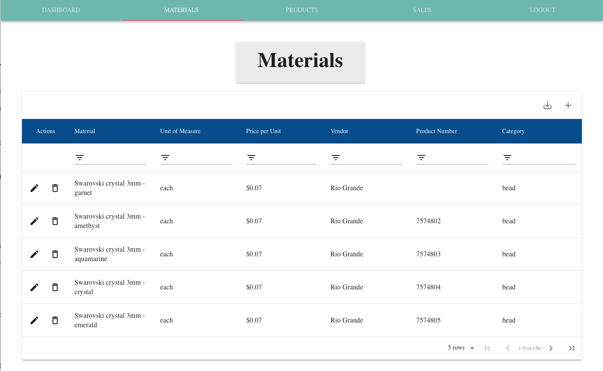
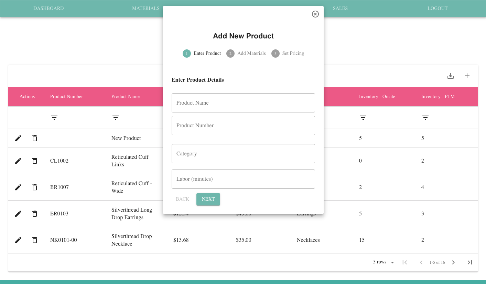
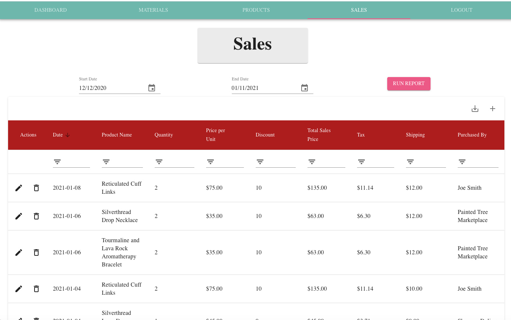

<p align="center">
 
</p>    

# <p align="center"><b>Silverthread Designs Business Management Software</b>

View a demo of Silverthread Designs Management Software on [YouTube](https://youtu.be/ZD8gCwgMNpI) </p> 

<!-- TABLE OF CONTENTS -->
## Table of Contents

* [About the Project](#about-the-project)
  * [Features](#features)
  * [Built With](#built-with)
* [Videos And Screenshots](#videos-and-screenshots)
* [Team Members](#team-members)
* [Acknowledgements](#acknowledgements)

## About the Project
Silverthread Designs is a jewelry company based in Houston, TX, whose owner was looking for assistance in organizing material and product information, tracking sales, calculating costs, and managing inventory at two locations. 

These goals were accomplished by using a series of filterable tables and user-friendly inputs, as well as providing sales data and exportable reports.

## Features
- Login/Logout using JTW for protecting data and routes
- Sales information shown through data tables
- Ability to track materials, vendor infortmation, and product numbers
- Ability to manage jewelry product details, including tracking materials used in production, calculating wholesale costs, and tracking inventory at two location
- Ability to track sales, discounts, tax, and shipping cost, and automatically adjust inventory based on the sales information.
- Ability to export reports to PDF or Excel spreadsheet

## Built With

Silverthread Inventory Management uses a number of powerful JS libraries and tools:

Client Side:
```sh
* Deployed using Surge
* React
* Redux
* React Router DOM 
* Redux toolkit
* Material UI
* Material Table
* Victory
* Date-io
* d3-scale-chromatic
* File Saver
* XLSX
* JSON Web Token 
```

Server Side:
```sh
* ElephantSQL Server
* Deployed using Heroku
* Node
* Express
* Express Sessions
* Sequelize
* CORS
* bcrypt JS
```
## Screenshots

View a demo of Silverthread Designs Management Software on [YouTube](https://youtu.be/ZD8gCwgMNpI

### Log In Page:


### Dashboard Page:


### Materials Page:


### Products Page with Add Product Input:


### Sales Page:


## Team Members
- Katy Donoghue - https://github.com/kjdonoghue
- Shannel Philp - https://github.com/S-Philp 
- Luigi Siopongco - https://github.com/luigisiops
- Chapman Chappelle - https://github.com/ChapmanChappelle


## Github Links
Client: https://github.com/luigisiops/silver-thread-client  
Server: https://github.com/luigisiops/silver-thread-api  
